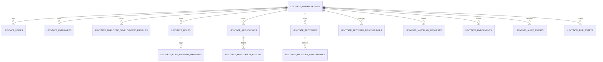

# LevyTate Production Foundation

## Objective

Sprint 3 replaces the remaining browser-owned MVP persistence with a production-shaped tenant foundation that can support real employer workspaces, secure sessions, auditability and future integrations.

The visible UX stays intentionally close to the current MVP. The change is architectural:

- server-backed workspace bootstrap
- organisation-aware data isolation
- durable Supabase persistence
- auditable business mutations
- storage preparation for files and documents

## Architecture Summary

### Runtime shape

1. LevyTate beta session is still created through the existing secure HTTP-only cookie flow.
2. On `/levytate/app`, the server resolves the signed beta session and bootstraps a LevyTate organisation + user context.
3. The client workspace loads from `/api/levytate-workspace`.
4. All workspace mutations now flow through a single server route instead of writing directly to browser storage.
5. When Supabase is unavailable, the client falls back to the legacy local snapshot so the MVP remains usable during configuration.

### Multi-tenancy

- Every operational record is scoped by `organisation_id`.
- The client never passes an organisation identifier to choose scope.
- The server derives scope from the authenticated LevyTate session and resolved organisation membership.

### Authentication

Current production-foundation stance:

- secure signed session cookie
- organisation-aware app user bootstrap
- role assignment on user records
- ready for future Supabase Auth or SSO subject mapping

Current user roles in the foundation:

- Platform Admin
- Employer Admin
- Apprenticeship Lead
- Line Manager
- Employee

## Database Schema

Primary migration:

- [supabase/migrations/006_create_levytate_production_foundation.sql](/C:/Users/james/OneDrive/Documents/New%20project/mpr-consulting-site/supabase/migrations/006_create_levytate_production_foundation.sql)

Core tables:

- `levytate_organisations`
- `levytate_users`
- `levytate_employees`
- `levytate_employee_development_profiles`
- `levytate_roles`
- `levytate_role_pathway_mappings`
- `levytate_applications`
- `levytate_application_history`
- `levytate_providers`
- `levytate_provider_programmes`
- `levytate_provider_relationships`
- `levytate_matching_requests`
- `levytate_enrolments`
- `levytate_early_access_requests`
- `levytate_audit_events`
- `levytate_file_assets`

## ERD

## Workspace Mutation Flow

Shared contract:

- [lib/levytate/mvp/api.ts](/C:/Users/james/OneDrive/Documents/New%20project/mpr-consulting-site/lib/levytate/mvp/api.ts)

Server persistence:

- [lib/server/levytate-workspace.ts](/C:/Users/james/OneDrive/Documents/New%20project/mpr-consulting-site/lib/server/levytate-workspace.ts)
- [app/api/levytate-workspace/route.ts](/C:/Users/james/OneDrive/Documents/New%20project/mpr-consulting-site/app/api/levytate-workspace/route.ts)

Client workspace store:

- [components/levytate-mvp/MvpWorkspaceStore.tsx](/C:/Users/james/OneDrive/Documents/New%20project/mpr-consulting-site/components/levytate-mvp/MvpWorkspaceStore.tsx)

## File Storage Preparation

Storage buckets created by migration:

- `levytate-organisations`
- `levytate-provider-documents`
- `levytate-uploads`

Metadata helper:

- [lib/server/levytate-file-assets.ts](/C:/Users/james/OneDrive/Documents/New%20project/mpr-consulting-site/lib/server/levytate-file-assets.ts)

This keeps uploads decoupled from UI work while giving Sprint 4+ a production place to register:

- logos
- provider documents
- reports
- evidence uploads
- policy files

## Environment Variables Required

Already used:

- `NEXT_PUBLIC_SUPABASE_URL`
- `SUPABASE_SERVICE_ROLE_KEY`
- `LEVYTATE_BETA_SESSION_SECRET`
- `LEVYTATE_BETA_CODE`

Already present for AI but unchanged by this sprint:

- `OPENAI_API_KEY`
- `LEVYTATE_AI_MODEL`
- `LEVYTATE_AI_ENABLED`

## Migration Notes

1. Run Supabase migration `006_create_levytate_production_foundation.sql`.
2. Ensure `NEXT_PUBLIC_SUPABASE_URL` and `SUPABASE_SERVICE_ROLE_KEY` are configured in Vercel.
3. Open `/levytate/app` with a valid beta session.
4. LevyTate will bootstrap:
   - organisation
   - user membership
   - seeded provider catalogue
5. If an older browser workspace snapshot exists and the server workspace is empty, the client will migrate that snapshot into Supabase through the new workspace route.

## Technical Debt Remaining

High:

- Production auth still uses the beta-cookie gateway rather than full Supabase Auth or SSO.
- Workspace mutations are routed through a generic API rather than resource-specific server actions.

Medium:

- Early Access CRM uses the existing API model and has not yet been upgraded to a richer internal management UI for notes, owners and timelines.
- Audit events are persisted but not yet exposed in a dedicated admin timeline module.
- File storage buckets are ready, but upload UI is not yet connected.

Low:

- Local fallback remains in place for resilience during environment setup.
- Provider catalogue seeding is duplicated per organisation for simplicity and should later move to a shared platform catalogue + tenant relationship model if required.
